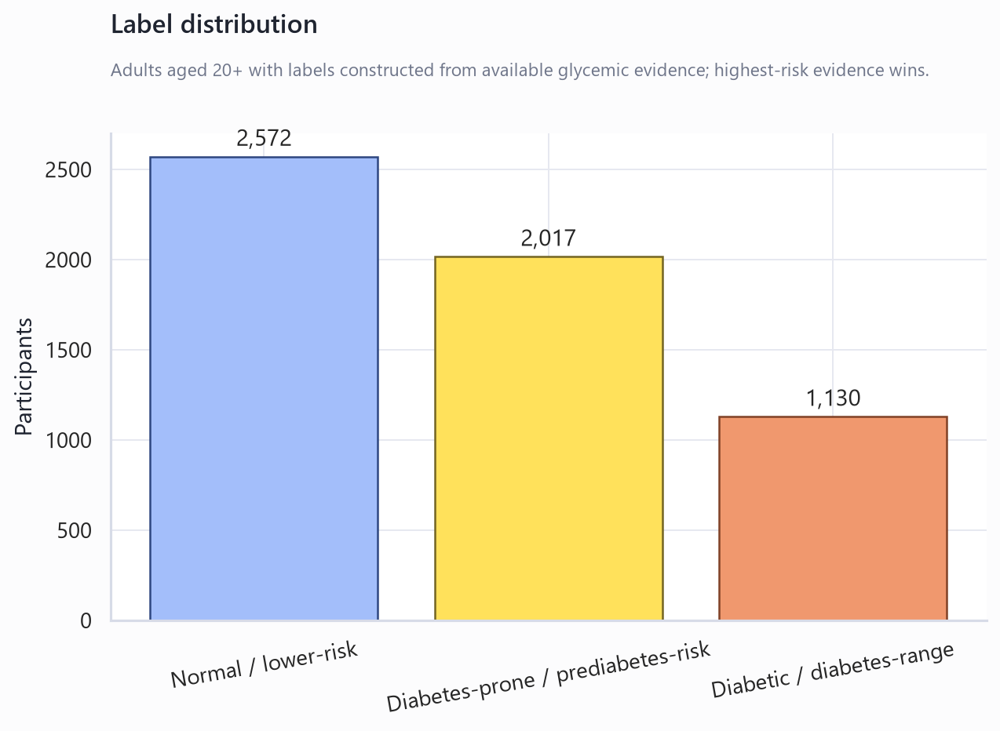
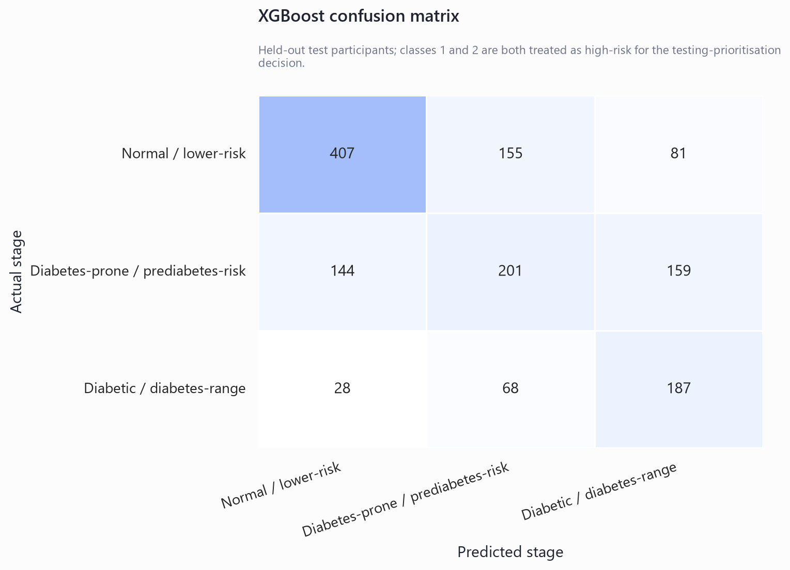
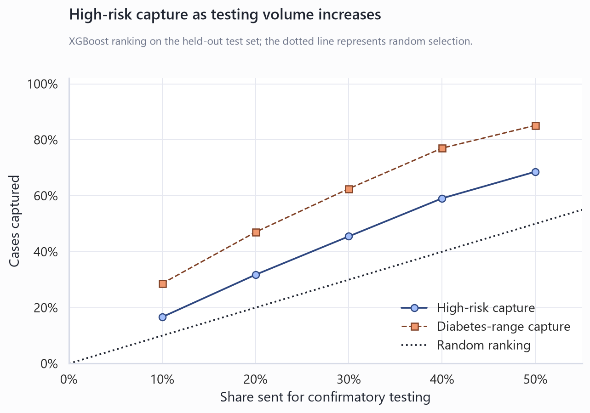
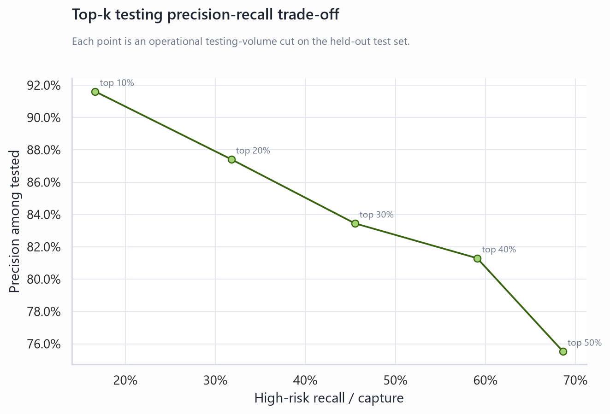
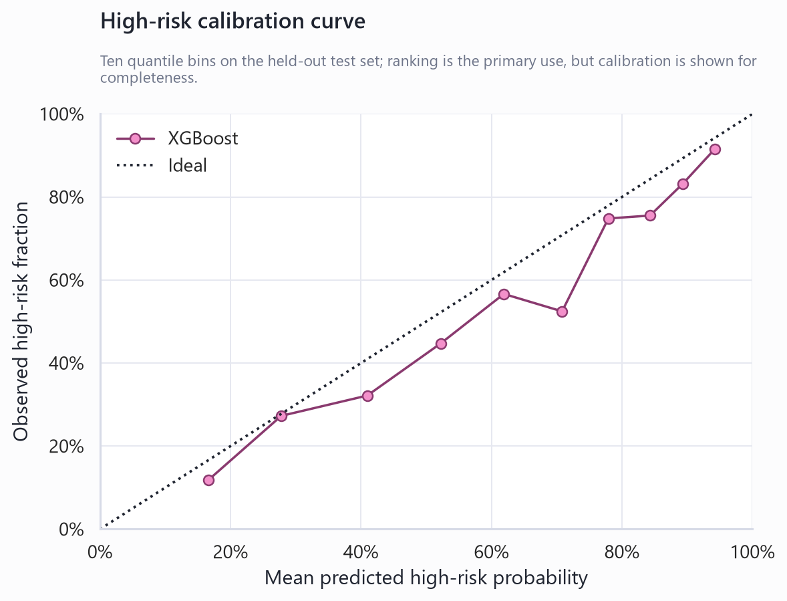

# NHANES Pilot Verdict

## Technical summary

**Decision: NO-GO — fall back to BRFSS.**

This pilot tested whether quickly collectable, non-glycemic Tier-1 indicators can rank adults for confirmatory HbA1c, fasting-glucose or OGTT testing. It does **not** diagnose diabetes. Glycemic variables and self-reported diabetes status were used only to construct the ground-truth stage.

**Recommendation:** NHANES Tier-1 pre-test prioritisation did not create enough incremental value. Recommended fallback: retain BRFSS as the official project and polish feature engineering, threshold tuning and reporting.

## Dataset files used

| component | filename | status | source_url |
| --- | --- | --- | --- |
| demographics | DEMO_I.XPT | available | https://wwwn.cdc.gov/Nchs/Data/Nhanes/Public/2015/DataFiles/DEMO_I.XPT |
| diabetes_questionnaire | DIQ_I.XPT | available | https://wwwn.cdc.gov/Nchs/Data/Nhanes/Public/2015/DataFiles/DIQ_I.XPT |
| body_measures | BMX_I.XPT | available | https://wwwn.cdc.gov/Nchs/Data/Nhanes/Public/2015/DataFiles/BMX_I.XPT |
| blood_pressure_exam | BPX_I.XPT | available | https://wwwn.cdc.gov/Nchs/Data/Nhanes/Public/2015/DataFiles/BPX_I.XPT |
| blood_pressure_questionnaire | BPQ_I.XPT | available | https://wwwn.cdc.gov/Nchs/Data/Nhanes/Public/2015/DataFiles/BPQ_I.XPT |
| medical_conditions | MCQ_I.XPT | available | https://wwwn.cdc.gov/Nchs/Data/Nhanes/Public/2015/DataFiles/MCQ_I.XPT |
| physical_activity | PAQ_I.XPT | available | https://wwwn.cdc.gov/Nchs/Data/Nhanes/Public/2015/DataFiles/PAQ_I.XPT |
| smoking | SMQ_I.XPT | available | https://wwwn.cdc.gov/Nchs/Data/Nhanes/Public/2015/DataFiles/SMQ_I.XPT |
| alcohol | ALQ_I.XPT | available | https://wwwn.cdc.gov/Nchs/Data/Nhanes/Public/2015/DataFiles/ALQ_I.XPT |
| diet | DBQ_I.XPT | available | https://wwwn.cdc.gov/Nchs/Data/Nhanes/Public/2015/DataFiles/DBQ_I.XPT |
| health_insurance | HIQ_I.XPT | available | https://wwwn.cdc.gov/Nchs/Data/Nhanes/Public/2015/DataFiles/HIQ_I.XPT |
| income | INQ_I.XPT | available | https://wwwn.cdc.gov/Nchs/Data/Nhanes/Public/2015/DataFiles/INQ_I.XPT |
| glycohemoglobin | GHB_I.XPT | available | https://wwwn.cdc.gov/Nchs/Data/Nhanes/Public/2015/DataFiles/GHB_I.XPT |
| fasting_glucose | GLU_I.XPT | available | https://wwwn.cdc.gov/Nchs/Data/Nhanes/Public/2015/DataFiles/GLU_I.XPT |
| ogtt | OGTT_I.XPT | available | https://wwwn.cdc.gov/Nchs/Data/Nhanes/Public/2015/DataFiles/OGTT_I.XPT |

The analytical cohort contains **5,719 adults aged 20 years or older** after the one-row-per-participant merge and age restriction. NHANES complex survey weights were not used for model fitting; results describe this feasibility sample, not population prevalence.

## Target construction and label distribution

When label markers disagreed, the highest-risk class was assigned.

| label_source | nhanes_variable | available | class_1_rule | class_2_rule |
| --- | --- | --- | --- | --- |
| self-reported doctor-diagnosed/borderline diabetes | DIQ010 | True | DIQ010 == 3 (borderline) | DIQ010 == 1 (doctor diagnosed) |
| self-reported prediabetes | DIQ160 | True | DIQ160 == 1 (ever told prediabetes) | not used for class 2 |
| HbA1c | LBXGH | True | 5.7 <= LBXGH <= 6.4 | LBXGH >= 6.5 |
| fasting plasma glucose | LBXGLU | True | 100 <= LBXGLU <= 125 mg/dL | LBXGLU >= 126 mg/dL |
| 2-hour OGTT glucose | LBXGLT | True | 140 <= LBXGLT <= 199 mg/dL | LBXGLT >= 200 mg/dL |

| class | count | class_name | percentage |
| --- | --- | --- | --- |
| 0 | 2572 | Normal / lower-risk | 0.450 |
| 1 | 2017 | Diabetes-prone / prediabetes-risk | 0.353 |
| 2 | 1130 | Diabetic / diabetes-range | 0.198 |

## Tier-1 features used

The main model used **65 available non-glycemic features**. Missing candidates were skipped rather than forced.

| feature | source_group | type | missing_pct |
| --- | --- | --- | --- |
| RIDAGEYR | demographics | numeric | 0.000 |
| RIAGENDR | demographics | categorical | 0.000 |
| RIDRETH3 | demographics | categorical | 0.000 |
| DMDEDUC2 | demographics | categorical | 0.000 |
| INDFMPIR | demographics | numeric | 0.111 |
| HIQ011 | demographics | categorical | 0.000 |
| BMXHT | anthropometrics | numeric | 0.053 |
| BMXWT | anthropometrics | numeric | 0.054 |
| BMXBMI | anthropometrics | numeric | 0.055 |
| BMXWAIST | anthropometrics | numeric | 0.105 |
| BPXSY1 | vitals | numeric | 0.099 |
| BPXSY2 | vitals | numeric | 0.077 |
| BPXSY3 | vitals | numeric | 0.081 |
| BPXSY4 | vitals | numeric | 0.958 |
| BPXDI1 | vitals | numeric | 0.099 |
| BPXDI2 | vitals | numeric | 0.077 |
| BPXDI3 | vitals | numeric | 0.081 |
| BPXDI4 | vitals | numeric | 0.958 |
| BPXPLS | vitals | numeric | 0.069 |
| BPQ020 | medical_history | categorical | 0.000 |
| BPQ080 | medical_history | categorical | 0.000 |
| BPQ040A | medical_history | categorical | 0.638 |
| BPQ090D | medical_history | categorical | 0.225 |
| MCQ160B | medical_history | categorical | 0.000 |
| MCQ160C | medical_history | categorical | 0.000 |
| MCQ160D | medical_history | categorical | 0.000 |
| MCQ160E | medical_history | categorical | 0.000 |
| MCQ160F | medical_history | categorical | 0.000 |
| SMQ020 | lifestyle | categorical | 0.000 |
| SMQ040 | lifestyle | categorical | 0.583 |
| PAQ605 | lifestyle | categorical | 0.000 |
| PAQ620 | lifestyle | categorical | 0.000 |
| PAQ650 | lifestyle | categorical | 0.000 |
| PAQ665 | lifestyle | categorical | 0.000 |
| PAD680 | lifestyle | numeric | 0.002 |
| ALQ101 | lifestyle | categorical | 0.133 |
| ALQ130 | lifestyle | numeric | 0.430 |
| ALQ141Q | lifestyle | numeric | 0.430 |
| ALQ141U | lifestyle | numeric | 0.776 |
| DBQ700 | lifestyle | categorical | 0.000 |
| DBD895 | lifestyle | numeric | 0.000 |
| DBD900 | lifestyle | numeric | 0.237 |
| DBD905 | lifestyle | numeric | 0.002 |
| DBD910 | lifestyle | numeric | 0.001 |
| INQ020 | socioeconomic_access | categorical | 0.035 |
| INQ012 | socioeconomic_access | categorical | 0.035 |
| bmi_category | engineered | categorical | 0.055 |
| waist_to_height_ratio | engineered | numeric | 0.106 |
| central_obesity_flag | engineered | numeric | 0.105 |
| age_band | engineered | categorical | 0.000 |
| bmi_x_age | engineered | numeric | 0.055 |
| bmi_x_waist | engineered | numeric | 0.107 |
| avg_systolic_bp | engineered | numeric | 0.071 |
| avg_diastolic_bp | engineered | numeric | 0.071 |
| pulse_pressure | engineered | numeric | 0.071 |
| mean_arterial_pressure | engineered | numeric | 0.071 |
| hypertension_flag | engineered | numeric | 0.000 |
| smoker_flag | engineered | numeric | 0.000 |
| physical_inactivity_flag | engineered | numeric | 0.000 |
| heavy_alcohol_flag | engineered | numeric | 0.430 |
| cholesterol_history_flag | engineered | numeric | 0.000 |
| cardiovascular_history_flag | engineered | numeric | 0.000 |
| cardiometabolic_history_count | engineered | numeric | 0.000 |
| low_income_access_risk_flag | engineered | numeric | 0.000 |
| insurance_gap_flag | engineered | numeric | 0.000 |

No clean, generally administered gestational-diabetes or PCOS history variable was identified in the selected 2015–2016 components, so no female-specific feature was forced into the model.

## Features excluded due to leakage

| variable_or_family | treatment |
| --- | --- |
| DIQ010 | Used only to construct the label |
| DIQ160 | Self-reported prediabetes; used only to construct the label |
| DIQ170 / DIQ172 | Diabetes-risk awareness/perception; excluded to avoid leakage |
| LBXGH | HbA1c; used only to construct the label |
| LBXGLU / LBDGLUSI | Fasting glucose and derivative; label-only/excluded |
| LBXGLT / LBDGLTSI | 2-hour OGTT glucose and derivative; label-only/excluded |
| HOMA-IR / TyG / glucose-derived features | Not constructed |

## Model comparison

| model | macro_f1 | class_0_recall | class_1_recall | class_2_recall | high_risk_recall | high_risk_precision | high_risk_pr_auc | high_risk_roc_auc | high_risk_brier_score |
| --- | --- | --- | --- | --- | --- | --- | --- | --- | --- |
| XGBoost | 0.542 | 0.633 | 0.399 | 0.661 | 0.781 | 0.723 | 0.809 | 0.788 | 0.191 |
| Logistic Regression | 0.546 | 0.641 | 0.399 | 0.668 | 0.785 | 0.728 | 0.807 | 0.785 | 0.194 |
| Simple Rule Score | 0.447 | 0.673 | 0.177 | 0.625 | 0.687 | 0.720 | 0.755 | 0.753 | 0.206 |

The business decision is based primarily on high-risk ranking quality and top-k capture, not on three-class accuracy alone.

## Top-k testing simulation

| model | testing_percentage | tested_n | testing_volume_reduction | high_risk_cases_captured | high_risk_capture_rate | diabetic_cases_captured | diabetic_capture_rate | diabetes_prone_cases_captured | diabetes_prone_capture_rate | number_needed_to_test | missed_high_risk_cases | precision_among_tested |
| --- | --- | --- | --- | --- | --- | --- | --- | --- | --- | --- | --- | --- |
| XGBoost | 10.0% | 143 | 90.0% | 131 | 16.6% | 81 | 28.6% | 50 | 9.9% | 1.092 | 656 | 91.6% |
| XGBoost | 20.0% | 286 | 80.0% | 250 | 31.8% | 133 | 47.0% | 117 | 23.2% | 1.144 | 537 | 87.4% |
| XGBoost | 30.0% | 429 | 70.0% | 358 | 45.5% | 177 | 62.5% | 181 | 35.9% | 1.198 | 429 | 83.4% |
| XGBoost | 40.0% | 572 | 60.0% | 465 | 59.1% | 218 | 77.0% | 247 | 49.0% | 1.230 | 322 | 81.3% |
| XGBoost | 50.0% | 715 | 50.0% | 540 | 68.6% | 241 | 85.2% | 299 | 59.3% | 1.324 | 247 | 75.5% |

## Testing required for target capture

| model | target_high_risk_recall | tested_n | minimum_testing_percentage | testing_volume_reduction | high_risk_cases_required |
| --- | --- | --- | --- | --- | --- |
| XGBoost | 70.0% | 731 | 51.1% | 48.9% | 551 |
| XGBoost | 80.0% | 871 | 60.9% | 39.1% | 630 |
| XGBoost | 90.0% | 1076 | 75.2% | 24.8% | 709 |

## Acceptance criteria

Criterion C defines “materially beats” before inspecting results as at least +0.03 high-risk PR-AUC and +0.05 absolute high-risk capture at top 30% or top 40% versus the simple rule score.

| criterion | definition | observed | passed |
| --- | --- | --- | --- |
| A | Top 30% captures >=70% OR top 40% captures >=80% of high-risk cases | top30=45.5%; top40=59.1% | False |
| B | At 80% high-risk recall, testing volume is reduced by >=40% | testing=60.9%; reduction=39.1% | False |
| C | XGBoost exceeds rule score by >=0.03 PR-AUC and >=0.05 top-k capture | PR-AUC delta=+0.054; top30 delta=+2.2%; top40 delta=+3.6% | False |

## Final recommendation

**NHANES Tier-1 pre-test prioritisation did not create enough incremental value. Recommended fallback: retain BRFSS as the official project and polish feature engineering, threshold tuning and reporting.**

Do not position this pilot as the replacement project. Keep the BRFSS work as the official project and retain this NHANES pilot as documented negative feasibility evidence.

## Limitations and robustness notes

- This is a held-out feasibility result from one NHANES cycle, not external validation.
- NHANES is a complex survey; unweighted predictive evaluation does not estimate US prevalence.
- Some fasting/OGTT labels are structurally missing because those tests apply to examination subsamples.
- Class 0 means no available criterion met the class 1 or class 2 thresholds; it does not prove absence of dysglycemia.
- Operational value depends on local prevalence, testing costs, capacity and acceptable miss rates.
